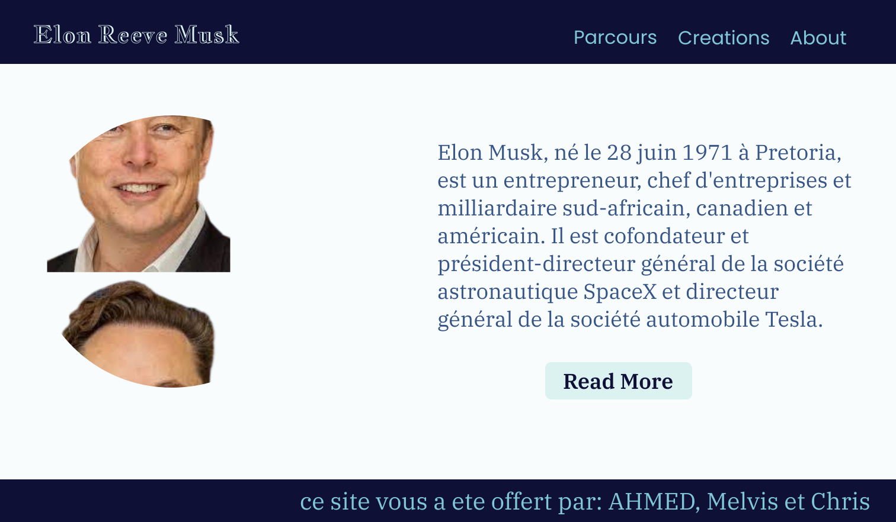

# Projet N2 de Worketyamo : Création d'une tribute page respossive

## bonsoir a tous, moi c'est Ahmed dans ce nouveau projet je vais procede a la creation d'un tribute page responsive comme le presente sur les images ci-dessous 

### maket pour destop

### maket pour telephone

